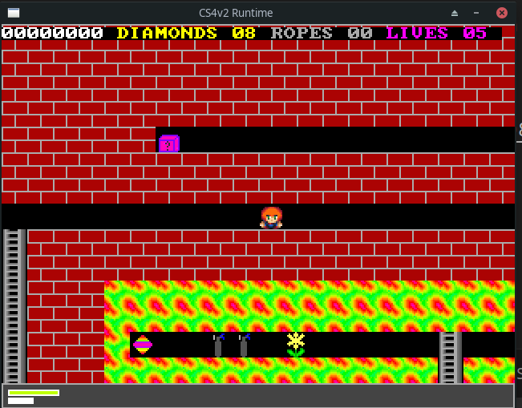

# CS4 Runtime SDL2

This project aims to port to the CS4 Runtime to a wide variety of platforms. 

Using the SDL2 libraries as a base, the game can now run as a desktop app or in the browser.





## Building the runtime

### Online version


The online version requires SDL2, zlib and Emscripten.


<b> Build cs4 runtime</b>

First install emscripten : https://emscripten.org/index.html

Run these commands
```
$ python bin/gen.py emsdl
$ emmake make
```

<b>Launch the application</b>


```
$ emrun build/cs4v2.html
```

### Map Editor

[cs4-map-edit](https://github.com/cfrankb/cs4-map-edit)

### Play online

Coming Soon

